## 🌀 Project Overview
A proof-of-concept exploring how Discord can be abused as a command-and-control (C2) channel.  
The PoC uses a lightweight Python bot that watches voice-state changes as a signaling mechanism. The goal: generate realistic host + network telemetry and demonstrate detection approaches using **Sysmon**, **Suricata**, and **Wireshark**.

Why Discord? It’s widely used, increasingly present in workplaces, and its encrypted WebSocket (WSS) traffic easily blends with legitimate activity — making it an attractive channel for stealthy C2 and an interesting detection challenge for defenders.

*(Screenshot – high-level lab diagram)*

---

## 🛠 Tools & Environment (At a Glance)
- **Attacker:** Kali Linux (attacker scripts / bot controller)  
- **Victim:** Windows 10 VM (developer workstation running the PoC agent)  
- **Detection Stack:** Sysmon (SwiftOnSecurity config recommended), Suricata (eve.json), Wireshark (pcap visualization)  
- **PoC Code:** Python + discord.py (bot uses official API; **bot token only**, never user tokens)  

Design note: the stack is intentionally minimal — a “low to the ground” view that emphasizes raw system + network telemetry rather than pre-aggregated SIEM alerts.

---

## 🎯 At-a-Glance TTPs (MITRE mapping)
| Tactic (MITRE ATT&CK)    | Technique (short)                         | ID / Label  |
|--------------------------|-------------------------------------------|-------------|
| Command & Control        | Application Layer Protocols (Web)         | **T1071.001** |
| Command & Control        | Web Service                               | **T1102**   |
| Execution                | Command execution via bot commands        | **T1059**   |
| Defense Evasion / C2     | Encrypted channel (WSS/TLS)               | **T1573**   |

**Proposed / Related event-driven behaviors** (candidates for sub-techniques):  
- **Event-driven beaconing** — agent signals only in response to local events (voice-state change, file event, etc.).  
- **Voice-state signaling** — using Discord voice-state updates (join/leave/mute/unmute) as a low-bandwidth trigger channel for C2.

> These “proposed” items reflect behaviors exercised in the lab and are offered as candidate sub-techniques or detection categories (not official ATT&CK entries).

---

## 🧩 Code Walkthrough
High-level flow (core logic, not full implementation details):

```text
1. Bot starts → connects to/watches Discord server
2. Any User Joins specified Voice Channel (admin)
3. Bot executes locally on victim (Text File Creation/Open Notepad, Create Registry Run Key, System Discovery commands)
4. Captures command output
5. Sends result back over Discord (WSS)
```

```mermaid
flowchart LR
    %% Nodes
    A[1️⃣ 🖥 Bot Starts on Victim Host] -->|Client Hello / WSS over TLS| B[2️⃣ ☁️ Discord Server]
    B -->|Voice State Event: User joins Admin Voice Channel| C[3️⃣ ⚡ Bot Executes Hardcoded Commands on Victim]
    C -->|Capture Output| D[4️⃣ 📤 Send to Hidden Discord Text Channel]

    %% Styling
    style A fill:#fdd,stroke:#f00,stroke-width:2px,color:#000
    style B fill:#ffd,stroke:#aa0,stroke-width:2px,color:#000
    style C fill:#dfd,stroke:#080,stroke-width:2px,color:#000
    style D fill:#ddf,stroke:#00f,stroke-width:2px,color:#000
```


---

## 🛡 Why This Matters for Defenders (TL;DR)

- **Opaque traffic** — Discord uses TLS/WSS over Cloudflare; network signatures are weak.  
- **Shared infrastructure** — IP/domain blocking causes collateral damage.  
- **Minimal defender telemetry** — APIs are designed for bot functionality, not security observability.  

**Practical takeaway:** defenders must correlate host (**Sysmon/EDR**) + network (**Suricata/pcap**) telemetry to detect abuse. Collaboration platforms could help by exposing *limited, privacy-preserving* telemetry (e.g., beacon metadata, voice-state events) to improve defender visibility.

*(Screenshot – Wireshark capture showing WSS bursts)*

